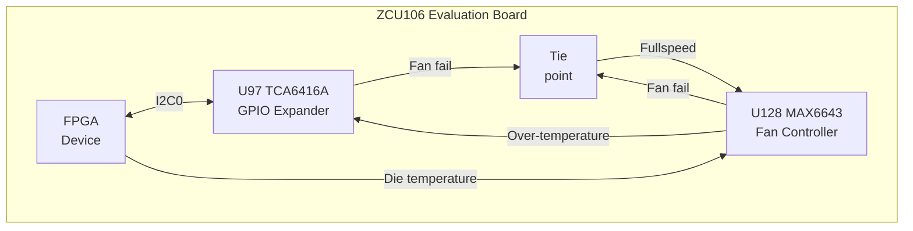

Minimalist FPGA design enabling low-noise fan operation on Xilinx's [ZCU106 evaluation board][x-zcu106].

# Quick start

- `make`

## Requirements

- A ZCU106 evaluation board
- A recent Linux version of Vivado

# Description

To quote the [board user guide][x-ug1244]:

> The fan speed (PWM) versus the FPGA die temperature algorithm along with the over temperature set point and fan failure alarm mechanisms are defined by the strapping resistors on the MAX6643 device. The over temperature and fan failures alarms can be monitored by the any available processor in the FPGA by polling the I2C expander, U97. See the [MAX6643 data sheet][max6643-ds] for more information on the device circuit implementation on this board.

In other words, the fan controller exposes the following pins:

| Name     | Direction | Description                                              |
| -------- | --------- | -------------------------------------------------------- |
| FULLSPD  | Input     |  When pulled high, the fan runs at 100% duty cycle       |
| FANFAIL# | Output    |  Asserted low when fan is not turning                    |
| OT#      | Output    | Asserted low when over-temperature threshold is exceeded |

As shown above the `FANFAIL#` and `FULLSPD` signals are tied on the PCB, meaning that the FPGA must set these signals low in order to switch to closed-loop fan speed mode. This behavior matches the board user guide which further states:

> Note: At initial power on, it is normal for the fan controller to energize at full speed for a few
seconds.

Thus, the firmware must issue I2C commands to the TCA6416A device for setting the pin corresponding to `MAX6643_FANFAIL_B` in a high state and also to set it in output mode.

| I2C Address | Register | Value | Description |
| ----------- | -------- | ----- | ----------- |
| `0x20` | `0x02` | `0x60` | Set output pin values |
| `0x20` | `0x06` | `0x97` | set pin directions |

# Credits

This design I2C interface relies modules copied from the [Taxi Transport Library](https://github.com/fpganinja/taxi) provided by FPGA Ninja, LLC under either the CERN Open Hardware Licence Version 2 - Strongly Reciprocal.

[//]: # (External Links)

[max6643-ds]: https://www.analog.com/media/en/technical-documentation/data-sheets/MAX6643-MAX6645.pdf
[x-zcu106]: https://www.xilinx.com/products/boards-and-kits/zcu106.html
[x-ug1244]: https://docs.amd.com/v/u/en-US/ug1244-zcu106-eval-bd